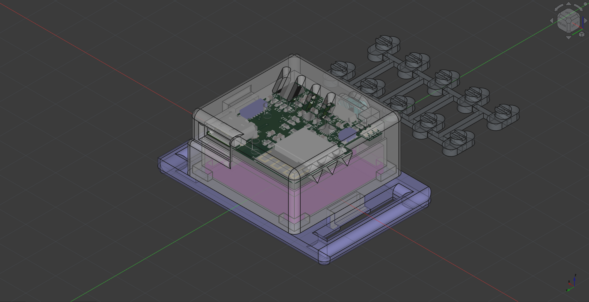
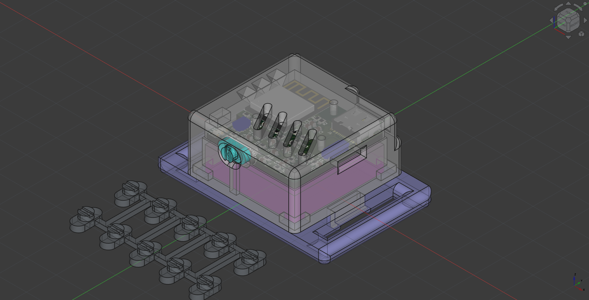
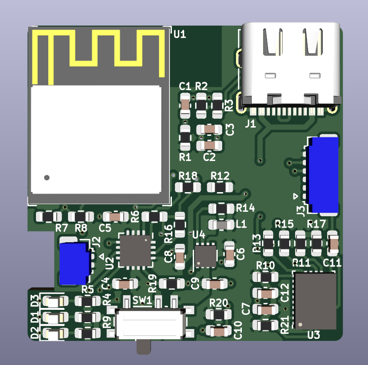
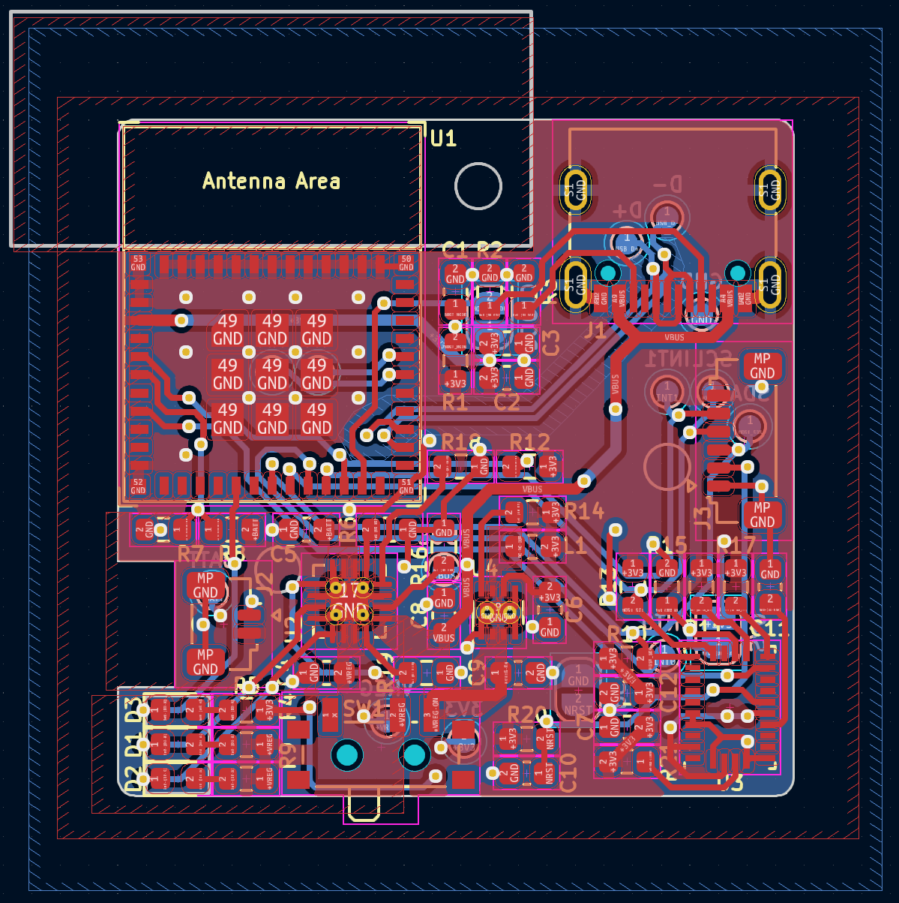
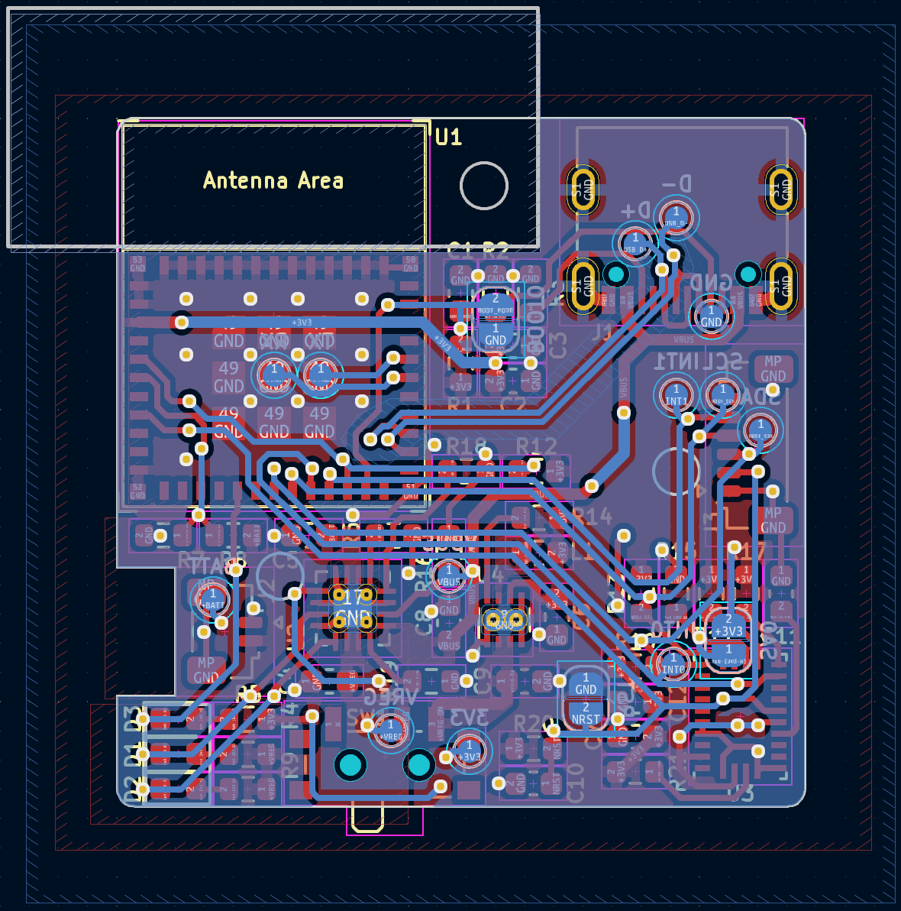

# SlimeVR-Tracker-HW by Xuan25

A design of SlimeVR Tracker by Xuan25

- PCB: PCB designed with KiCAD 7.0
- Case: Case designed with FreeCAD 1.0.0
- Adapted firmware is available [here](https://github.com/xuan25/SlimeVR-Tracker-ESP)

## Features

- IMU: BNO085; MCU: ESP32-C3
- 3D printed case
- 2-layer PCB
- firmware uploading via USB
- 9-hour durability with 700mAh 803030 Li-Po battery
- Dimension: 57mm (l) x 37mm (w) x 23mm (h)
- Optimized for hand soldering (hot plate required), with enough spacing to comfortably handle 0603 SMD components and maintain adequate clearance.

## Preview

## Production Resources

### Files

See the [latest release](https://github.com/xuan25/SlimeVR-Tracker-HW/releases/latest) for the production files:

- `PCB-gbr.zip`: Gerber files for PCB production  
- `PCB-BOM.csv`: Bill of Materials for PCB assembly  
- `PCB-assembly-scale4.pdf`: Component reference for PCB assembly  
- `3DP.zip`: STL model files for 3D printing  

### Assembly

In addition to the materials listed in the BOM for PCB assembly, you will also need:

- `700mAh 803030 3.7V Lithium Polymer Battery` x1 (the battery)
- `SSUH-003T-P0.15` x2 (socket contacts for the battery)
- `SUHR-02V-S-B` x1 (socket contact housing)
- `28AWG FEP Wire` x2 (wires connect the battery and the PCB)
- `2mm thick EVA Foam Craft Sheets` x1 (spacer between the battery and the PCB)
- `25mm width Elastic Band` + `Accessories`

plus:

- `138°C Low Temperature Soldering Paste`
- `Solder Flux`
- `PCB Cleaning Solution` + `Brush`
- `8mm Polyimide Tape` + `30mm Polyimide Tape` (for battery breakout board insulation)

Required tools include:

- `ENGINEER PAD-11 Handy Crimp Tool` (crimp battery connectors)
- `Hotplate for SMD Soldering`
- `Soldering Iron`
- `Tweezers`
- `Diagonal cutting plier` + `Sandpaper` (3D printing post-processing)
- (Optional) `Light and Magnifier`

## Please note: Before you send the case model to your 3D printer

**You may want to update the following parameters in the Case design Spreadsheet to match the performance of your 3D printer and material.**

- **Tol**: Adjusts the clearance between mating parts. Increase this value if your 3D printer cannot achieve tight tolerances, ensuring the parts fit together properly despite limited printing accuracy.
- **SnapFitNotchWidth**: Controls the depth of the snap-fit notch. A larger value can provide a more robust snap-fit connection but requires the material to have better toughness.
  - Plastics are usually stronger than resin, so you should consider to use a lower value.
- **BaseMargin**: Controls the margin of the base. Since the snap-fit will catch on the base’s margin, a smaller margin requires the material to have sufficient strength to ensure a reliable snap-fit connection.
  - Resin are usually softer than plastics, so you should consider to use a greater value.
